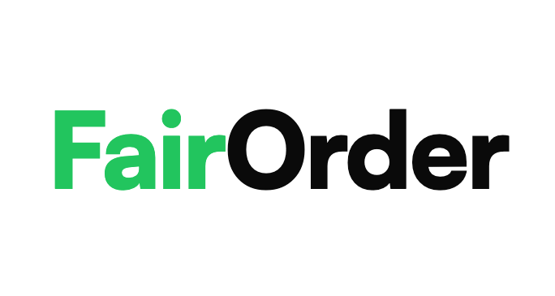

<p align="center">
  
</p>

**Open-source canteen ordering system — operators sign up, import menus via AI extraction, and get a live QR-scannable menu page.**

Guests scan, order, kitchen prepares. Self-host in one command with Docker Compose.

---

## Features

### For Operators
- **Magic Link Auth** — Passwordless login via email, no passwords to manage
- **AI Menu Import** — Upload a photo or paste a URL, AI extracts structured menu data (Google Gemini via Vercel AI SDK)
- **Optional Prepayment** — Stripe integration for pay-before-pickup, or cash at the till
- **3-Step Onboarding** — Location setup, menu import, QR code — live in minutes
- **Multi-Location** — One account, many locations

### For Guests
- **Public Menu Page** — Each location gets a shareable URL (`/your-location`) showing the live menu
- **QR Code Ordering** — Scan to view the menu and place orders, no app required
- **No App Required** — Works in any mobile browser

### For Kitchens
- **Kitchen Display** — Token-authenticated display at `/display/:token` for wall-mounted screens
- **Order Workflow** — Simple status progression from received to pickup

### Order Workflow
```
┌─────────┐    ┌───────────┐    ┌─────────┐    ┌───────────┐
│ PENDING │ ─→ │ PREPARING │ ─→ │  READY  │ ─→ │ COMPLETED │
└─────────┘    └───────────┘    └─────────┘    └───────────┘
                                      │
                                      └─→ CANCELLED
```

---

## Tech Stack

| Layer | Technology |
|-------|------------|
| **Framework** | Next.js 16 (App Router) |
| **Language** | TypeScript (strict mode) |
| **Database** | PostgreSQL + Prisma v7 |
| **Styling** | Tailwind CSS v4, Radix UI, shadcn/ui |
| **Auth** | Magic link (passwordless, httpOnly cookies) |
| **AI** | Vercel AI SDK + Google Gemini (structured output) |
| **Email** | Pluggable: Plunk, SMTP, or Console |
| **Payment** | Pluggable: Stripe (prepayment) or Cash (default) |
| **Testing** | Vitest |

---

## Getting Started

### Docker (recommended)

```bash
git clone https://github.com/RayNCooper/fairorder.git
cd fairorder
docker compose up
```

Open [http://localhost:3000](http://localhost:3000). Database is migrated and seeded automatically.

### Manual Setup

```bash
git clone https://github.com/RayNCooper/fairorder.git
cd fairorder
pnpm install
cp .env.example .env    # Edit DATABASE_URL
pnpm db:generate
pnpm db:migrate
pnpm db:seed
pnpm dev:local
```

### Available Scripts

| Command | Description |
|---------|-------------|
| `pnpm dev` | Start dev server (dotenvx — maintainers) |
| `pnpm dev:local` | Start dev server (plain .env — contributors) |
| `pnpm build` | Production build |
| `pnpm start` | Start production server |
| `pnpm lint` | Run ESLint |
| `pnpm test` | Run Vitest test suite |

---

## Project Structure

```
fairorder/
├── app/
│   ├── (auth)/           # Login, register, verify-email
│   ├── (onboarding)/     # 3-step wizard: setup, menu-import, complete
│   ├── [slug]/           # Public menu page (guest-facing, no auth)
│   ├── display/[token]/  # Kitchen display (token-authenticated)
│   ├── dashboard/        # Operator admin panel
│   └── api/              # REST API routes
├── components/
│   ├── ui/               # shadcn/ui design system (0px radius)
│   ├── auth/             # Magic link forms
│   ├── dashboard/        # Nav, menu manager, order list, import
│   ├── display/          # Kitchen display components
│   ├── onboarding/       # Setup form, AI menu import, QR display
│   └── public/           # Public menu page, payment form
├── lib/
│   ├── auth.ts           # Session management
│   ├── db.ts             # Prisma client
│   ├── email.ts          # Email provider (plunk/smtp/console)
│   ├── payment.ts        # Payment provider (stripe/cash)
│   ├── menu-extraction.ts # AI menu extraction (gemini/console)
│   ├── menu-crawler.ts   # URL crawler for menu import
│   ├── storage.ts        # Image upload
│   ├── magic-link.ts     # Token creation & verification
│   └── utils.ts          # cn() helper
├── prisma/
│   ├── schema.prisma     # Database schema
│   └── seed.ts           # Demo data
└── public/               # Static assets
```

---

## Database Schema

```
┌──────────────┐       ┌──────────────┐       ┌──────────────┐
│     User     │       │   Location   │──────<│   Category   │
├──────────────┤       ├──────────────┤       ├──────────────┤
│ id           │──────<│ id           │       │ id           │
│ email        │       │ name         │       │ name         │
│ name         │       │ slug         │       │ sortOrder    │
└──────────────┘       │ timezone     │       │ isActive     │
       │               │ adminToken   │       └──────────────┘
       │               │ displayToken │              │
┌──────────────┐       │ paymentOn    │       ┌──────────────┐
│   Session    │       └──────────────┘       │   MenuItem   │
├──────────────┤              │               ├──────────────┤
│ id           │              │               │ id           │
│ token        │              │               │ name         │
│ expiresAt    │              │               │ price        │
└──────────────┘              │               │ isAvailable  │
                              │               └──────────────┘
                       ┌──────────────┐              │
                       │    Order     │──────<┌──────────────┐
                       ├──────────────┤       │  OrderItem   │
                       │ orderNumber  │       ├──────────────┤
                       │ customerName │       │ quantity     │
                       │ status       │       │ unitPrice    │
                       │ pickupTime   │       │ notes        │
                       │ paymentMethod│       └──────────────┘
                       │ paymentStatus│
                       └──────────────┘
```

---

## Email Providers

Configure via `EMAIL_PROVIDER` environment variable:

| Provider | Use case | Required env vars |
|----------|----------|-------------------|
| `console` | Development (default) | None |
| `smtp` | Self-hosting | `SMTP_HOST`, `SMTP_FROM` |
| `plunk` | Hosted version | `PLUNK_API_KEY` |

## Payment Providers

Configure via `PAYMENT_PROVIDER` environment variable:

| Provider | Use case | Required env vars |
|----------|----------|-------------------|
| `cash` | Default — pay at the till | None |
| `stripe` | Online prepayment | `STRIPE_SECRET_KEY`, `NEXT_PUBLIC_STRIPE_PUBLISHABLE_KEY`, `STRIPE_WEBHOOK_SECRET` |

## Menu Extraction Providers

Configure via `MENU_EXTRACTION_PROVIDER` environment variable:

| Provider | Use case | Required env vars |
|----------|----------|-------------------|
| `console` | Development (default) | None |
| `gemini` | Production — AI extracts menus from images and URLs | `GEMINI_API_KEY` |

---

## Contributing

See [CONTRIBUTING.md](CONTRIBUTING.md) for setup and guidelines.

---

## Security

See [SECURITY.md](SECURITY.md) for vulnerability disclosure policy.

---

## License

[AGPL-3.0](LICENSE)

---

<p align="center">
  <sub>Built with TypeScript</sub>
</p>
